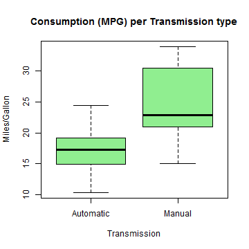
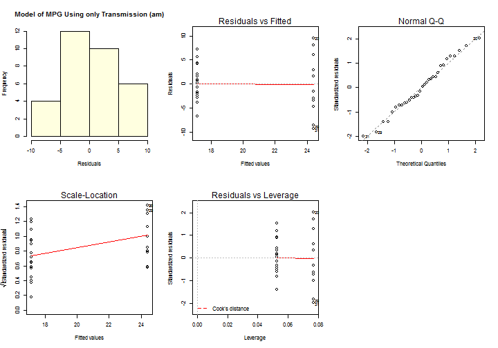

Automatic or Manual Transmission for More Miles per Gallon?
========================================================
## Executive Summary
The purpose of this report is to examine the differences between automatic and manual transmission and the impact of each to miles per gallon (MPG) consumption. The data used for this analysis is the **mtcars** data set included in R. 

The findings of the analysis can be summarised as follows:
* We observed that cars with automatic transmission have lower consumption than cars with manual transmission
* In quantifying the MPG difference between automatic and manual transmission, we discovered that transmission type alone is not enough to tell the difference. However, when combined with # of cylinders (cyl) and weight (wt) we get a model with good prediction accuracy and we can deduce that on average an increase in weight causes a decrease of 3.1 in MPG and an increase in the number of cylinders causes a decrease of 1,5 in MPG.

## Data Processing
The data used for this analysis is the **mtcars** data set included in R. The data set was loaded in R and used directly without the need of any preprocessing.


## Results
### 1. Is automatic or manual transmission better for MPG?
#### Exploratory Data Analysis
The transmission variable is categorical that takes the values 0 for Automatic and 1 for Manual. Boxplots are a good way to present the consumption distribution (mpg) against each transmission type. From the plot below it is evident that  cars with automatic transmission have lower consumption.
 


More specifically the cars with automatic transmission have an average of **17.1474** and the cars with manual transmission have an average of **24.3923**. However, the correlation between transmission and MPG is **0.5998** which is very low. This makes us suspect that there could be more variables in the data set that need to be included to explain the MPG consumption.

#### Linear Regresssion & Model Selection
We start by fitting a model that predicts the MPG using the transmission type as the only predictor.


#### Interpretting the Coefficients
The model coefficients are: intercept = **17.1474** and slope= **7.2449**. The intercept is equal to the average MPG for cars with automatic transmission which does not make much sense but helps establish a baseline. The slope shows that when we switch from manual to automatic transmission we gain on average **7.2449** MPG.

#### Using the Residuals to Diagnose the Model Accuracy 
We looked at the residuals plot and a histogram of the residuals. From the histogram we observe that residuals are approximately normally distributed and the QQ Plot shows some normality.  There is also some indication that there is an excess of large residuals and the spread is  quite large.

 


In addition to the residuals we see that the value of R-squared is **0.3598** which is very low indicating that our model is not a good fit to the data.

#### Multiple Models Fit and Model Selection Strategy
To find a model that fits our data better we start introducing more predictor variables in addition to transmission. We have selected the variables with the highest correlation with mpg and run the following 5 models with mpg as the output variable and a different predictors:
* Model1 (fit1): 1 predictor: am
* Model2 (fit2): 2 predictors: - am + cyl
* Model3 (fit3): 3 predictors: am + cyl + wt
* Model4 (fit4): 4 predictors: am + cyl + wt + disp
* Model5 (fitAll): predictors: all


To select the best model we examined the p-value and R-squared values of each model. In addition, we used the Akaike's ‘An Information Criterion (AIC) function to cross check and confirm our initial validation. The best model given by the AIC function was **Model3**.

### 2. Quantify MPG difference between automatic and manual transmission
We discovered that transmission type alone is not enough to predict the difference in MPG consumption. However, when combined with the number of cylinders (cyl) and weight (wt) we get a model with good prediction accuracy. In this section we quantify the MPG different between automatic and manual transmissions combined with cylinder and weight.

#### Quantify the uncertainty as a conclusion and Perform inference
To quantify we used the results of **Model3** with predictors transmission, cylinders and weight. 


```
##             Estimate Std. Error t value  Pr(>|t|)
## (Intercept)  39.4179     2.6415 14.9228 7.425e-15
## am            0.1765     1.3045  0.1353 8.933e-01
## cyl          -1.5102     0.4223 -3.5764 1.292e-03
## wt           -3.1251     0.9109 -3.4309 1.886e-03
```


First, we quantify the **model accuracy** using the residual standard error (RSE) and the R-squared values.

The **RSE value is 2.6** which means that on average the estimated response deviates in 2.6 MPG from the actual response. The **residuals** show that in the worst case there is a deviation of 6.1 (max residual) in the MPG response, and that most of the estimates deviate between -1.5 to 1.6 MPG (1Q to 3Q) from the actual responses. In addition, the R-squared (**0.8122**) value shows that our model have an 81% fit to the data. This indicates that we have the right model, but there is some room for improvement. Finally, the **p-value** is very small that indicates a correlation between the predictor variables and the responses.

Next we look at the coefficients. We start by looking only at what the am (transmission type) predictor gives assuming we hold all other variables constant. We observe that the **Pr value** for transmission is very large indicating that there is 89% chance of getting this coefficient by chance rather than because of correlation between am and mpg. In other words the transmission type alone does not tell us much about the MPG consumption. On the contrary, the other predictors cyl and wt are highly (reversely) correlated to the MPG consumption. The coefficients of cyl and wt, combined with am, show that on average an increase in weight causes a decrease of 3.1 in MPG and an increase in the number of cylinders causes a decrease of 1,5 in MPG.
